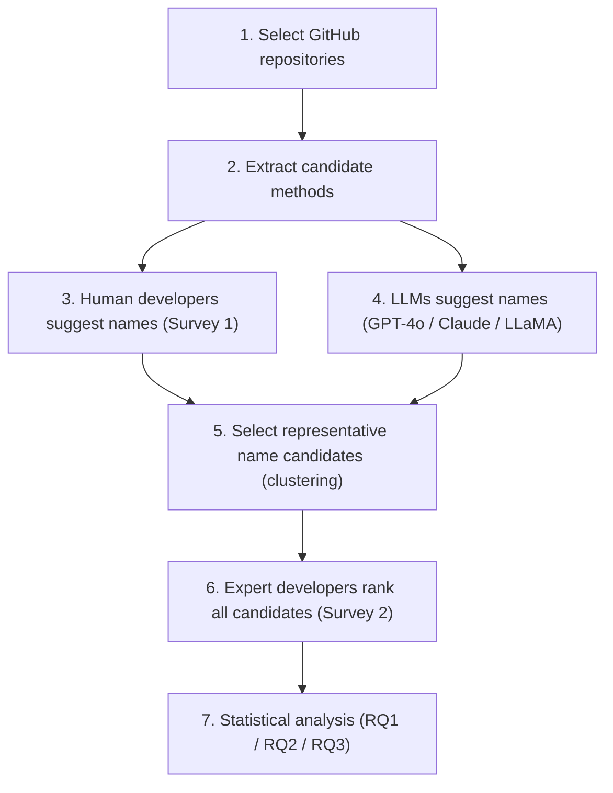

NamingRefactoring
=================

This repository is a **research project** that evaluates the impact of large language models (LLMs) on renaming tasks, with a current focus on **method renaming** across multiple programming languages (Java / Python / JavaScript).  

The overall workflow is:

- **Select GitHub repositories with specific characteristics**: From the defined criteria, select 30 repositories, 10 each in Java, Python, and JavaScript (JS).
- **Randomly extract 15 methods**: randomly sample 15 methods (signature + body implementation), five each in Java, Python, and JS from the selected repositories and store the output result in a file
- **Extract method implementations from real selected methods**: multi-language AST / parser–based extraction
- **Human developers method name suggestions:**: Submit the extracted method body implementations to human developers to suggest names via Survey 1
- **LLMs method name suggestions**: Submit the extracted method body implementations to the three LLMs for method name suggestions through prompting
- **Expert ranking**:Submit the extracted method body implementations alongside all suggested method names to expert developers, who will rank them from most to least appropriate using a Lickert scale
- **Analyze the results**: Apply statistical test to answer the three research questions RQ1, RQ2, and RQ3

---

Repository Structure
--------------------

- [`GitHubRepoSelection/`](GitHubRepoSelection/)  
  - Contains the notebook [`Github repo selection.ipynb`](GitHubRepoSelection/Github%20repo%20selection.ipynb).  
  - Used to select candidate GitHub repositories by language (Java / Python / JavaScript), with filters on stars, forks, project size, and heuristics to exclude tutorial / documentation repositories.

- [`MethodExtraction/`](MethodExtraction/)  
  - **Core code directory** that extracts methods from the selected repositories and calls LLMs for method name suggestions.  
  - It is organized by language :
    - **Python**: e.g. [`Python/main.py`](MethodExtraction/Python/main.py)  
      - Uses the built‑in Python `ast` module for AST parsing.  
      - Filters methods by length (target ≈ 50 lines with ±20 line tolerance), skipping test methods and magic methods.  
      - LLM caller scripts: [`LLMApiCallGpt.py`](MethodExtraction/Python/LLMApiCallGpt.py), [`LLMApiCallClaude.py`](MethodExtraction/Python/LLMApiCallClaude.py), [`LLMApiCallLlama.py`](MethodExtraction/Python/LLMApiCallLlama.py), etc.  
    - **JavaScript**: e.g. [`JavaScript/javascript_method_parser.js`](MethodExtraction/JavaScript/javascript_method_parser.js)  
      - Uses Acorn JS parser to extract function declarations, function expressions, arrow functions, and class methods.  
      - Name suggestion scripts: [`gpt4o_method_name_suggester.js`](MethodExtraction/JavaScript/gpt4o_method_name_suggester.js), [`claude_method_name_suggester.js`](MethodExtraction/JavaScript/claude_method_name_suggester.js), [`llama_method_name_suggester.js`](MethodExtraction/JavaScript/llama_method_name_suggester.js).  
    - **Java**: e.g. [`Java/JavaMethodExtractor.java`](MethodExtraction/Java/src/main/java/JavaMethodExtractor.java)  
      - Uses ANTLR4 + a Java 20 grammar for parsing and method extraction.  
      - Name suggestion implementations: [`JavaMethodNameSuggester.java`](MethodExtraction/Java/src/main/java/JavaMethodNameSuggesterGPT.java), [`JavaMethodNameSuggesterClaude.java`](MethodExtraction/Java/src/main/java/JavaMethodNameSuggesterClaude.java), [`JavaMethodNameSuggesterLLaMA.java`](MethodExtraction/Java/src/main/java/JavaMethodNameSuggesterLLaMA.java).

- [`ResultFiles/`](ResultFiles/)  
  - Stores CSV outputs for extracted methods and LLM suggestions, split into language‑specific subdirectories: [`Java/`](ResultFiles/Java/), [`JavaScript/`](ResultFiles/JavaScript/), [`Python/`](ResultFiles/Python/).  
  - For each language you typically find:
    - `random_methods_[language].csv`: random sample of target methods (columns usually include: Fully Qualified Name, File Path, Method Name, Method Body, Line Count, etc.).  
    - `[llm]_suggestedMethodNames_[language].csv`: LLM name suggestions (adds context token counts, context snippets, and one or more suggested names).  
  - LLMs currently used include **GPT‑4o, Claude (Sonnet), LLaMA (Llama‑4‑Maverick)** and similar.

- [`Algorithm/`](Algorithm/) and [`AnalyzingData/`](AnalyzingData/)  
  - [`Algorithm/`](Algorithm/): select two method names among the 23 suggested names by human developers using hierachical clustering
  - [`AnalyzingData/`](AnalyzingData/): apply the selected statistical test to the expert ranking data for each research question (RQ1, RQ2, and RQ3)

---

Full Pipeline — How It Works
-----------------------------

End‑to‑end, the project moves through seven stages, each stage consuming the output of the previous one:



### 1. Select GitHub repositories
- Run the [`Github repo selection.ipynb`](GitHubRepoSelection/Github%20repo%20selection.ipynb) notebook.  
- It filters candidate repositories by stars, forks, and project size, and excludes tutorial / documentation repos.  
- Output: **30 repositories** — 10 each for Java, Python, and JavaScript.

### 2. Extract candidate methods
- The language‑specific extractors in [`MethodExtraction/`](MethodExtraction/) parse the cloned repositories: Python's built‑in `ast` module, the Acorn parser for JavaScript, and an ANTLR4 + Java‑20 grammar for Java.  
- Methods are filtered by length (≈ 50 lines ± 20), skipping test methods and magic methods, then **15 methods are randomly sampled** (5 per language).  
- Output: [`ResultFiles/[Language]/random_methods_[language].csv`](ResultFiles/) — signature, file path, method body, and line count for each sampled method.

### 3. Human developers suggest names (Survey 1)
- The extracted method bodies (with the original name hidden) are shown to human developers, who each propose a name via **Survey 1**.  
- Results are stored outside this repo — see the [Google Drive link](https://drive.google.com/drive/folders/1zb5eCZ6lSQ-VjXH4JzBdCcDjpVQzB1p_?usp=drive_link) below.

### 4. LLMs suggest names
- The same method bodies are sent to three LLMs — **GPT‑4o, Claude (Sonnet), and LLaMA (Llama‑4‑Maverick)** — using the caller scripts under [`MethodExtraction/`](MethodExtraction/) (e.g. `LLMApiCallGpt.py`, `claude_method_name_suggester.js`, `JavaMethodNameSuggesterLLaMA.java`).  
- Output: [`ResultFiles/[Language]/[llm]_suggestedMethodNames_[language].csv`](ResultFiles/), including the prompt context and one or more suggested names per method.

#### How the LLMs are called

Every language (Python, JavaScript, Java) follows the same calling convention, just via a different SDK/HTTP client, so results stay comparable across models and languages:

- **Models used**:
  - GPT‑4o via the OpenAI API (`model: "gpt-4o"`).
  - Claude via the Anthropic API (`model: "claude-3-7-sonnet-20250219"`).
  - LLaMA via TogetherAI's OpenAI‑compatible endpoint (`model: "meta-llama/Llama-4-Maverick-17B-128E-Instruct-FP8"`, `POST https://api.together.xyz/v1/chat/completions`).
- **Authentication**: each script reads its key from an environment variable (`OPENAI_API_KEY`, `ANTHROPIC_API_KEY`, `LLAMA_API_KEY`) and raises an error if it's missing — no keys are hard‑coded in the repo.
- **Prompt construction**:
  1. The method's own name is stripped out of its signature (`def method_name`) so the model can't just echo it back — this is the "name anonymized" step.
  2. Surrounding code (everything in the file before/after the method) is pulled in as extra **context**, and `tiktoken` (`cl100k_base` encoding) is used to count/truncate that context so the whole prompt fits the model's token budget (context tokens + a fixed prompt‑overhead + a reserved 300‑token response budget).
  3. A fixed template is sent as a system + user message pair: a system instruction to act as a naming assistant, and a user message containing the anonymized body, the context, and "Provide method name suggestions as a numbered list, no explanations."
- **Sampling settings**: `temperature = 0.5` and `max_tokens = 300` on every model, so responses stay short, consistent, and only mildly randomized run to run.
- **Retry handling**: the GPT and LLaMA callers retry with backoff on rate‑limit errors; failures are recorded as `"N/A"` / `"METHOD_NOT_FOUND"` in the output CSV rather than crashing the batch.
- **Output**: each script iterates row‑by‑row over `random_methods_[language].csv` and appends the model's numbered‑list response (plus context and context‑token count) to `[llm]_suggestedMethodNames_[language].csv`.

### 5. Select representative name candidates
- [`Algorithm/identifier_name_selection.py`](Algorithm/identifier_name_selection.py) pools the ~23 human‑ and LLM‑suggested names per method, tokenizes each identifier (camelCase / snake_case aware), and scores it against ground‑truth tokens extracted from the method body.  
- It builds a Jaccard‑similarity matrix over the proposed names and runs **hierarchical (average‑linkage) clustering**, then picks one exemplar per cluster.  
- This narrows the candidate pool down to **2 representative names per method**, keeping the next survey manageable.

### 6. Expert developers rank all candidates (Survey 2)
- The original method name plus the 2 selected candidate names are shown to expert developers, who rank them from most to least appropriate on a **Likert scale** via **Survey 2**.  
- Results are also available in the [Google Drive link](https://drive.google.com/drive/folders/1zb5eCZ6lSQ-VjXH4JzBdCcDjpVQzB1p_?usp=drive_link).

### 7. Statistical analysis
- The scripts in [`AnalyzingData/`](AnalyzingData/) consume the expert ranking data to answer the three research questions:
  - [`RQ1.py`](AnalyzingData/RQ1.py) — Friedman test + Nemenyi post‑hoc, comparing expert‑rated quality across LLMs, human developers, and original method names.
  - [`RQ2.py`](AnalyzingData/RQ2.py) — Chi‑square test of independence (with Cramér's V effect size) per LLM, checking whether naming quality varies across Java, Python, and JavaScript.
  - [`RQ3.py`](AnalyzingData/RQ3.py) — Descriptive breakdown of High / Medium / Low quality name suggestions per LLM and per language.

---

Workflow for the first three steps / How to Use
---------------------

> Note: This is research code. Several scripts contain **hard‑coded paths and API keys**. Before reproducing any experiments, adapt these values to your environment.

### 1. Environment Setup

- **Core software**
  - Python 3 (3.12+ recommended) with dependencies such as `openai`, `anthropic`, `tiktoken`, `requests`, etc.
  - Node.js (≥ 14 recommended) for JavaScript parsing and JS‑based LLM client scripts.
  - Java (JDK and Maven) for Java method extraction and LLM clients.

- **External services / API keys**
  - OpenAI (for GPT‑4o and related models).
  - Anthropic (for Claude models).
  - TogetherAI or other providers exposing LLaMA‑family models.


### 2. Selecting GitHub Repositories

- Open and run [`GitHubRepoSelection/Github repo selection.ipynb`](GitHubRepoSelection/Github%20repo%20selection.ipynb).  
- Configure and execute the notebook to select repositories that satisfy the constraints (language, stars, forks, size, etc.).  
- Clone the selected repositories locally to a directory that matches the hard‑coded or configured paths used by the extraction scripts.

### 3. Method Extraction

Once the target language repositories are cloned locally, run the language‑specific extraction scripts:

- **Python method extraction**
  - Go to [`MethodExtraction/Python/`](MethodExtraction/Python/).  
  - Configure the code root directory (many scripts assume something like `/Users/yourUsername/Documents/Lab/Github_repos/`; you should change this to your own path).  
  - Run:

    ```bash
    python main.py
    ```

- **JavaScript method extraction**
  - Go to [`MethodExtraction/JavaScript/`](MethodExtraction/JavaScript/).  
  - Install dependencies:

    ```bash
    npm install
    ```

  - Adjust the code root path in the script if necessary, then run:

    ```bash
    node javascript_method_parser.js
    ```

- **Java method extraction**
  - Go to [`MethodExtraction/Java/`](MethodExtraction/Java/) (or the corresponding Maven module).  
  - Ensure ANTLR4 and Maven configuration are correct, then compile and run:

    ```bash
    mvn compile
    mvn exec:java -Dexec.mainClass="...JavaMethodExtractor"   # set mainClass according to your actual project config
    ```

For all languages, the extraction scripts apply a line‑count filter (≈ 50 lines ± 20) and write results to `ResultFiles/[Language]/random_methods_[language].csv`.

### 4. Generating LLM Method Name Suggestions

After extraction, invoke the language‑ and model‑specific scripts to generate name suggestions. Typical scripts include:

- **Python**
  - [`LLMApiCallGpt.py`](MethodExtraction/Python/LLMApiCallGpt.py)
  - [`LLMApiCallClaude.py`](MethodExtraction/Python/LLMApiCallClaude.py)
  - [`LLMApiCallLlama.py`](MethodExtraction/Python/LLMApiCallLlama.py)

- **JavaScript**
  - [`gpt4o_method_name_suggester.js`](MethodExtraction/JavaScript/gpt4o_method_name_suggester.js)
  - [`claude_method_name_suggester.js`](MethodExtraction/JavaScript/claude_method_name_suggester.js)
  - [`llama_method_name_suggester.js`](MethodExtraction/JavaScript/llama_method_name_suggester.js)

- **Java**
  - [`JavaMethodNameSuggesterGPT.java`](MethodExtraction/Java/src/main/java/JavaMethodNameSuggesterGPT.java)
  - [`JavaMethodNameSuggesterClaude.java`](MethodExtraction/Java/src/main/java/JavaMethodNameSuggesterClaude.java)
  - [`JavaMethodNameSuggesterLLaMA.java`](MethodExtraction/Java/src/main/java/JavaMethodNameSuggesterLLaMA.java)

Before running these scripts:

- Make sure the required API keys are available (environment variables or config files).  
- Update any input CSV paths so they point to `ResultFiles/[Language]/random_methods_[language].csv`.  

Each script writes its results to `ResultFiles/[Language]/[llm]_suggestedMethodNames_[language].csv`.

---

Result Files
------------

**1. `random_methods_[language].csv`**

- Produced by the method extraction scripts.  
- Typical columns:
  - `Fully Qualified Name`: fully qualified method name (including class and package / namespace).  
  - `File Path`: relative path to the source file.  
  - `Method Name`: original method name.  
  - `Method Body`: the method body as multi‑line code text.  
  - `Line Count`: number of lines in the method.  

**2. `[llm]_suggestedMethodNames_[language].csv`**

- Produced by the LLM‑based name suggestion scripts.  
- In addition to the method information above, it usually adds:
  - `Context Tokens`: number of tokens in the prompt context (for controlling length / model limits).  
  - `Context`: the code context fed to the LLM (e.g. surrounding code in addition to the method body).  
  - `Suggested Names` / `Top-k Names`: one or more candidate names generated by the model.  

These CSVs are then used for:

- Comparing naming quality across different models.  
- Comparing LLM suggestions with original names (e.g. readability or similarity).  
- Studying differences across languages and project types.

---


Important Notes
---------------

- **Hard‑coded paths**  
  - Several scripts use absolute paths like `/Users/durjoy/Documents/Lab CSSE/Github_repos/` and `/Users/durjoy/Documents/Lab CSSE/Result_files/`.  
  - Before running in a different environment, unify these to the correct local paths or refactor them into configurable parameters.

---


### Human developers method name suggestions and experts ranking results
Survey 1 and Survey 2 questions and answers are accessible [here](https://drive.google.com/drive/folders/1zb5eCZ6lSQ-VjXH4JzBdCcDjpVQzB1p_?usp=drive_link)


Contributing
------------

Contributions are welcome, especially in the following areas:

- Adding support for more languages or parsers.  
- Integrating additional LLM providers or model variants.  
- Implementing and refining analysis scripts (RQ1/RQ2/RQ3).  
- Improving configuration (removing hard‑coded paths and secrets, making pipelines more reproducible).  

You can open Issues or submit Pull Requests to propose improvements and extensions.
